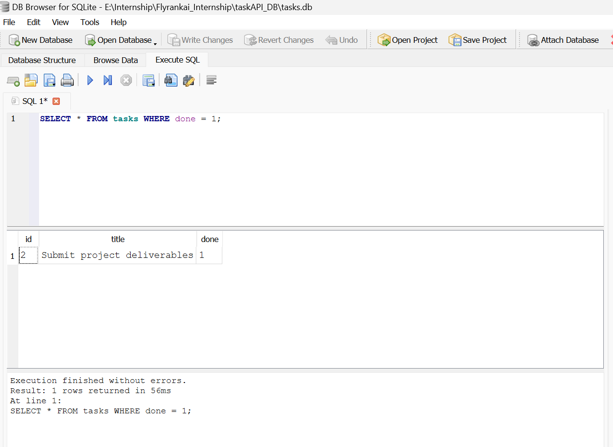

# Task API A1

A small in-memory CRUD API for managing a to-do list, built with Node.js and Express.
Built for FlyRank Internship — Backend Track — Week 2 — Assignment A1.

## What this is

A REST API that lets a client create, read, update, and delete tasks. Data is stored
in memory only (a JavaScript array) — it resets whenever the server restarts. There is
no database yet.

## How to install & run

```bash
npm install
node server.js
```

The server starts on **http://localhost:3000**.
Interactive Swagger docs are at **http://localhost:3000/docs**.

## Endpoints

| Method | Path            | Description                        | Success | Errors        |
|--------|-----------------|-------------------------------------|---------|---------------|
| GET    | `/`             | API info                            | 200     | —             |
| GET    | `/health`       | Health check                        | 200     | —             |
| GET    | `/tasks`        | List all tasks (supports `?done=` and `?search=`) | 200 | — |
| GET    | `/tasks/:id`    | Get a single task                   | 200     | 404 not found |
| POST   | `/tasks`        | Create a task (`{ "title": "..." }`)| 201     | 400 invalid   |
| PUT    | `/tasks/:id`    | Update a task's `title` and/or `done` | 200   | 400 invalid, 404 not found |
| DELETE | `/tasks/:id`    | Delete a task                       | 204     | 404 not found |
| GET    | `/stats`        | Task counts (total/done/open)       | 200     | —             |
| POST   | `/reset`        | Restore the 3 seed tasks            | 200     | —             |

## Example request

```bash
curl.exe -i -X POST http://localhost:3000/tasks -H "Content-Type: application/json" -d "@body.json"
```

```
HTTP/1.1 201 Created
X-Powered-By: Express
Content-Type: application/json; charset=utf-8
Content-Length: 51

{"id":4,"title":"Review pull request","done":false}
```

I also verified the full CRUD cycle end-to-end via curl: `GET /tasks/99` → `404`,
`POST /tasks` with an empty body → `400`, `PUT /tasks/4` → `200`, `DELETE /tasks/4` → `204`,
and a follow-up `GET /tasks/4` → `404`, confirming the delete actually took effect.

## Swagger UI


# Task API A2
Built for FlyRank Internship — Backend Track — Week 2 (A1) & Week 3 (A2).

## What this is

Originally (A1) data lived only in a JavaScript array in memory and was lost on every restart. This
version (A2) stores tasks in a real SQLite database file, so data now survives restarts.
The API's endpoints, request/response shapes, and status codes are unchanged from A1 —
only the storage layer underneath was swapped.

## Why SQLite

SQLite was chosen because it needs no separate database server. The entire database is
a single file on disk (`tasks.db`), created automatically the first time the app runs.
That makes it ideal for a small project like this: zero setup, zero configuration, and
still real SQL underneath. For higher-traffic or multi-server applications you'd
typically graduate to something like PostgreSQL, but SQLite is the right tool for a
single-file, single-process API like this one.

## Where the database file lives

The database is a single file, `tasks.db`, created in the project root the first time
you run the server. It is **git-ignored** on purpose (see `.gitignore`) — every fresh
clone of this repo starts with no `tasks.db`, and the app creates it automatically (with
the table and 3 seed tasks) on first run.

## How to install & run

```bash
npm install
npm start
```

The server starts on **http://localhost:3000**.
Interactive Swagger docs are at **http://localhost:3000/docs**.

On first run, `tasks.db` is created automatically with a `tasks` table and 3 seed tasks.
On every later run, the seed step detects the table isn't empty and skips itself — so
restarting never duplicates the seed data.

## Endpoints

| Method | Path            | Description                        | Success | Errors        |
|--------|-----------------|-------------------------------------|---------|---------------|
| GET    | `/`             | API info                            | 200     | —             |
| GET    | `/health`       | Health check                        | 200     | —             |
| GET    | `/tasks`        | List all tasks (supports `?done=` and `?search=`) | 200 | — |
| GET    | `/tasks/:id`    | Get a single task                   | 200     | 404 not found |
| POST   | `/tasks`        | Create a task (`{ "title": "..." }`)| 201     | 400 invalid   |
| PUT    | `/tasks/:id`    | Update a task's `title` and/or `done` | 200   | 400 invalid, 404 not found |
| DELETE | `/tasks/:id`    | Delete a task                       | 204     | 404 not found |
| GET    | `/stats`        | Task counts (total/done/open), computed with SQL `COUNT(*)` | 200 | — |
| POST   | `/reset`        | Restore the 3 seed tasks            | 200     | —             |

## Example request

```bash
curl.exe -i -X POST http://localhost:3000/tasks -H "Content-Type: application/json" -d "@body.json"
```

```
HTTP/1.1 201 Created
Content-Type: application/json; charset=utf-8

{"id":4,"title":"Review pull request","done":false}
```

output for curl.exe -i http://localhost:3000/tasks:
```
HTTP/1.1 200 OK
X-Powered-By: Express
Content-Type: application/json; charset=utf-8
Content-Length: 222
ETag: W/"de-9kcADHH6G7FDdXKSnB1YPj9epzg"
Date: Fri, 31 Jul 2026 12:19:36 GMT
Connection: keep-alive
Keep-Alive: timeout=5

[{"id":1,"title":"Complete Assignment 1","done":false},{"id":2,"title":"Submit project deliverables","done":true},{"id":3,"title":"Write a progress report","done":false},{"id":4,"title":"Review pull request","done":false}]
```

## Exploring the database directly (Stage 4)

Opened `tasks.db` in [DB Browser for SQLite](https://sqlitebrowser.org/) and ran:

```sql
SELECT * FROM tasks WHERE done = 1;
```

This returned the 1 task I'd marked done,
confirming the done column is stored correctly as 0/1.

 

After running `UPDATE tasks SET done = 1;` directly in DB Browser (no restart), calling
`GET /tasks` through the running API immediately showed every task as done — proof that
the API and DB Browser are reading the exact same file, with no syncing step needed.


