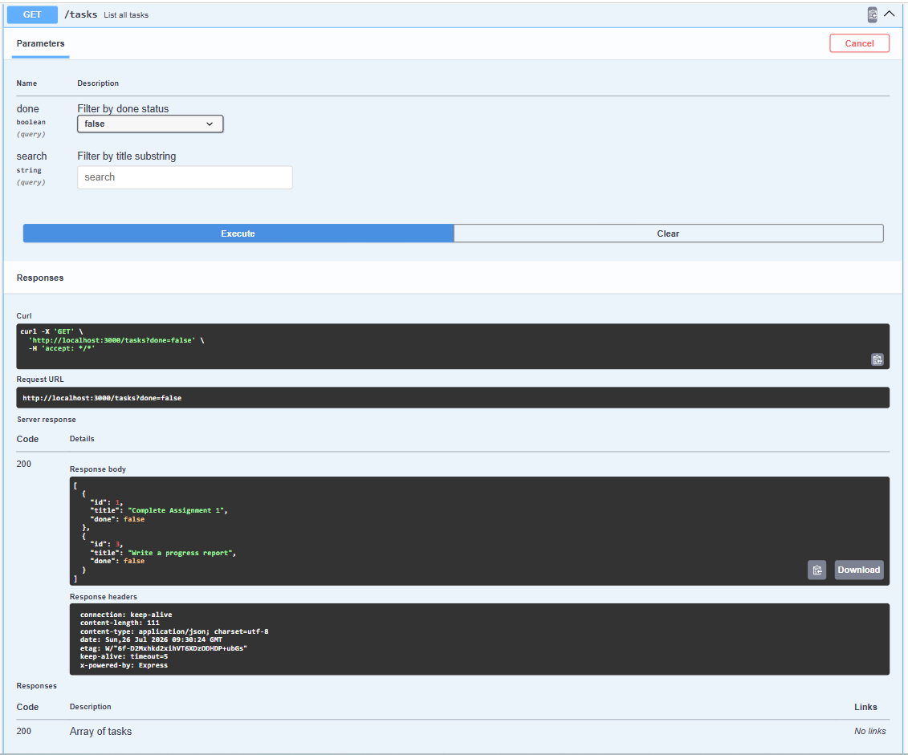

# Task API

A small in-memory CRUD API for managing a to-do list, built with Node.js and Express.
Built for FlyRank Internship — Backend Track — Week 2 — Assignment A1.

## What this is

A REST API that lets a client create, read, update, and delete tasks. Data is stored
in memory only (a JavaScript array) — it resets whenever the server restarts. There is
no database yet; that's next week.

## How to install & run

```bash
npm install
node server.js
```

The server starts on **http://localhost:3000**.
Interactive Swagger docs are at **http://localhost:3000/docs**.

## Endpoints

| Method | Path            | Description                        | Success | Errors        |
|--------|-----------------|-------------------------------------|---------|---------------|
| GET    | `/`             | API info                            | 200     | —             |
| GET    | `/health`       | Health check                        | 200     | —             |
| GET    | `/tasks`        | List all tasks (supports `?done=` and `?search=`) | 200 | — |
| GET    | `/tasks/:id`    | Get a single task                   | 200     | 404 not found |
| POST   | `/tasks`        | Create a task (`{ "title": "..." }`)| 201     | 400 invalid   |
| PUT    | `/tasks/:id`    | Update a task's `title` and/or `done` | 200   | 400 invalid, 404 not found |
| DELETE | `/tasks/:id`    | Delete a task                       | 204     | 404 not found |
| GET    | `/stats`        | Task counts (total/done/open)       | 200     | —             |
| POST   | `/reset`        | Restore the 3 seed tasks            | 200     | —             |

## Example request

```bash
curl -i -X POST http://localhost:3000/tasks \
  -H "Content-Type: application/json" \
  -d '{"title":"Buy milk"}'
```

```
HTTP/1.1 201 Created
Content-Type: application/json; charset=utf-8

{"id":4,"title":"Buy milk","done":false}
```

<!-- TODO: paste your own `curl -i` output here for at least one endpoint -->

## Swagger UI

<!-- TODO: paste your screenshot of http://localhost:3000/docs here, e.g. -->
<!--  -->

## The mortality experiment

<!-- TODO (optional extra): restart the server after creating a task, GET /tasks again,
and write two sentences here about what you saw and why it happened. -->

## AI vs me

<!-- TODO (Stage 7, bonus): if you do the AI rematch, put your prompt and
your three findings here. -->
